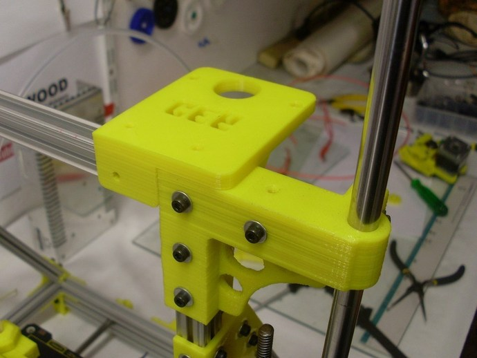
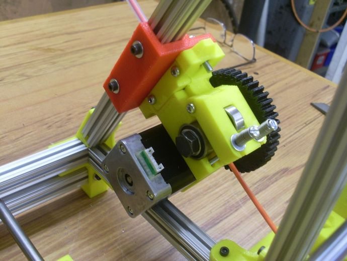
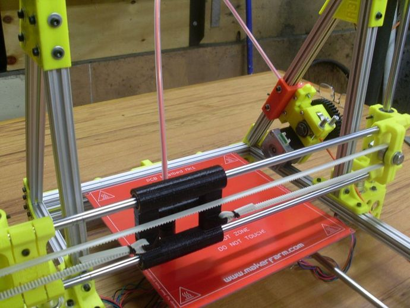

 Upgrade 3D Priner
========
## == ИДЕИ ==

[**Моторы сверху**](https://github.com/soda-io/mendel-upgrade/tree/master/Images/Motors)
- если нам поставить моторы сверху, то возможно удастся избежать перекоса шпилек оси "Z"

[**Жесткая конструкция**](https://github.com/soda-io/mendel-upgrade/blob/master/Images/photo.jpg)
- удобнее обслуживать принтер, широкий выбор места для датчиков, а так же удобнее снимать модели

[**Новая конструкция стола**](https://github.com/soda-io/mendel-upgrade/tree/master/Images/New%20Bed)
- легко обслуживать печатный стол, а так же повысит жесткость осей, что позволить избежать перекосов оси "Y" и ремня

[**Перевернутые оси "X"**](https://github.com/soda-io/mendel-upgrade/tree/master/Images/X)
- Новое местоположение моторов упростит калибровку оси "Z"

[**Замена ремня на резьбовую ось**](https://github.com/soda-io/mendel-upgrade/tree/master/Images/New%20Y)
- улучшит качество моделей, так как движение стола будет более медленным

[==Запчасти==](https://github.com/soda-io/SPRiNTR/blob/master/Mendel/Spareparts.md)

