mendel-upgrade
==============

Prepare upgrade for Mendel Max

**Моторы сверху**

- Я думаю, что если нам поставить моторы сверху, то возможно удастся избежать перекоса шпилек оси "Z"

**Жесткая конструкция**

- Жесткая конструкция позволит удобнее обслуживать принтер, широкий выбор места для датчиков, а так же удобнее снимать модели

**Новая конструкция стола**
- Новая конструкция стола поможет легко обслуживать печатный стол, а так же повысит жесткость осей, что позволить избежать перекосов оси "Y" и ремня

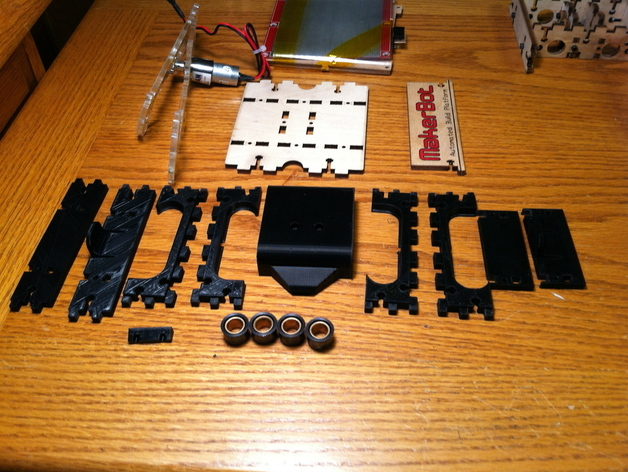

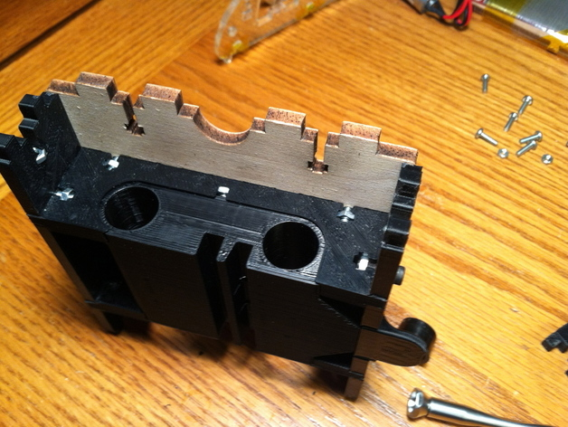	

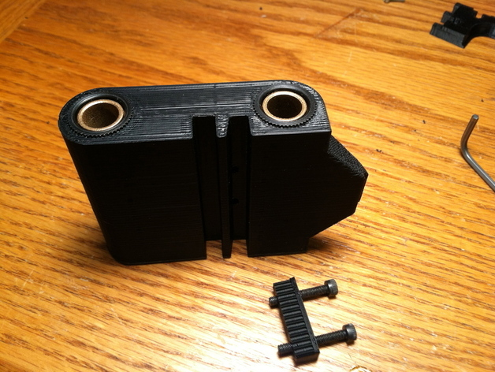	

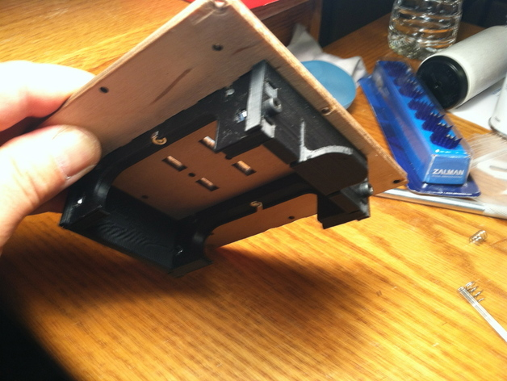	

	

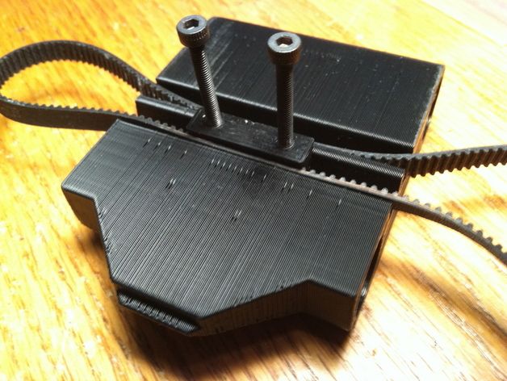	

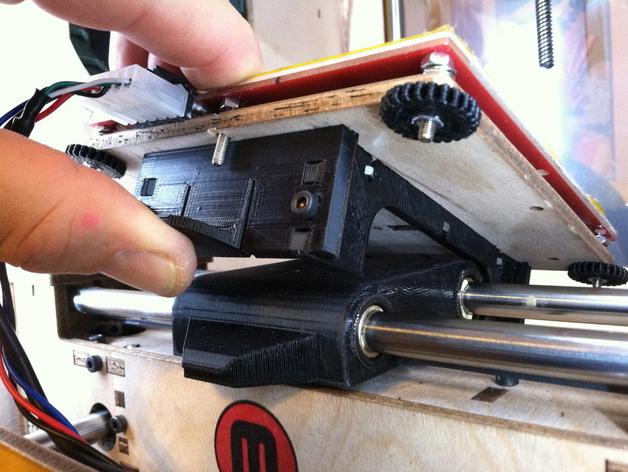	

	

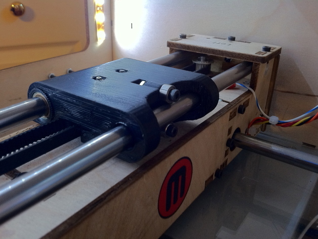

**Перевернутые оси "X"**

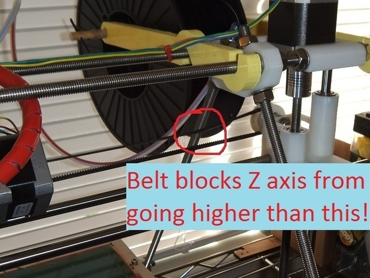	

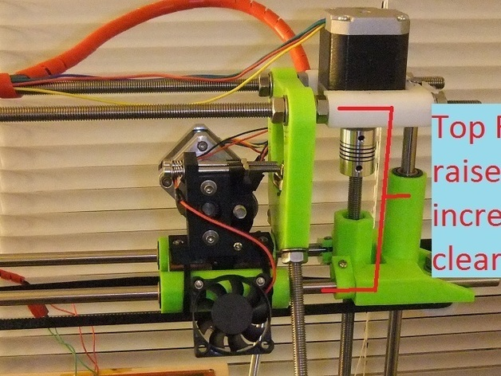

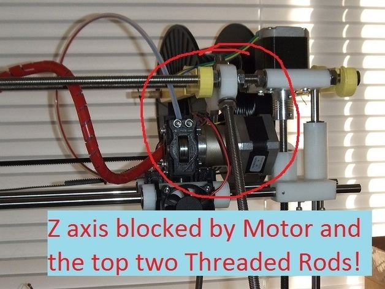	

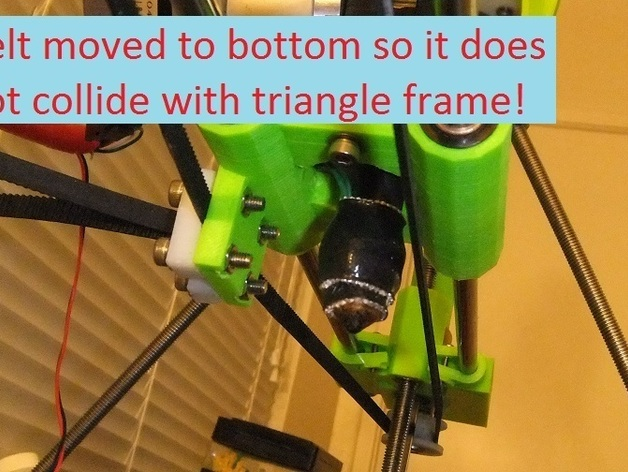
