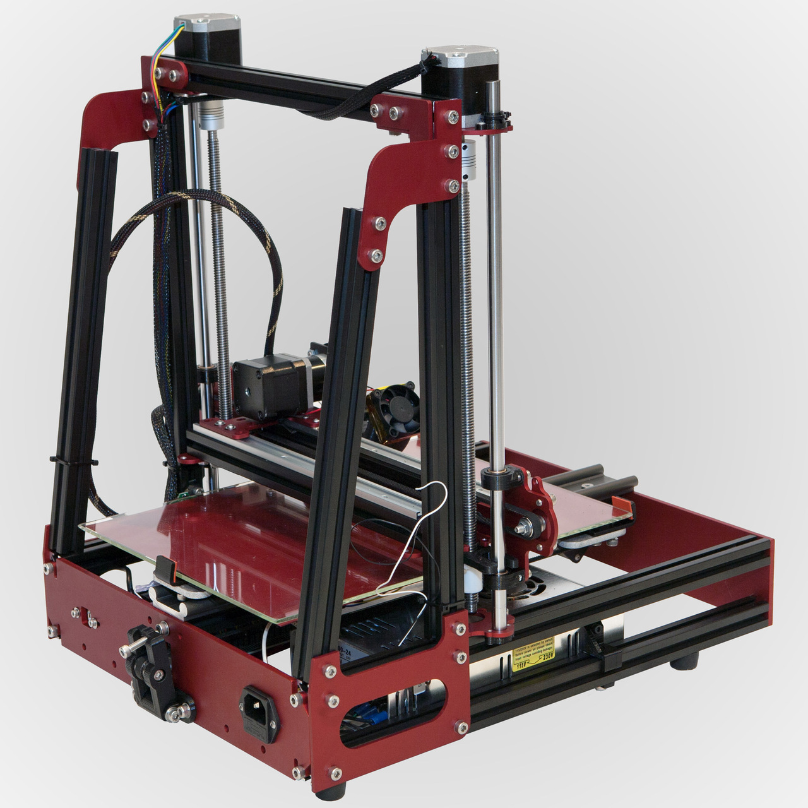
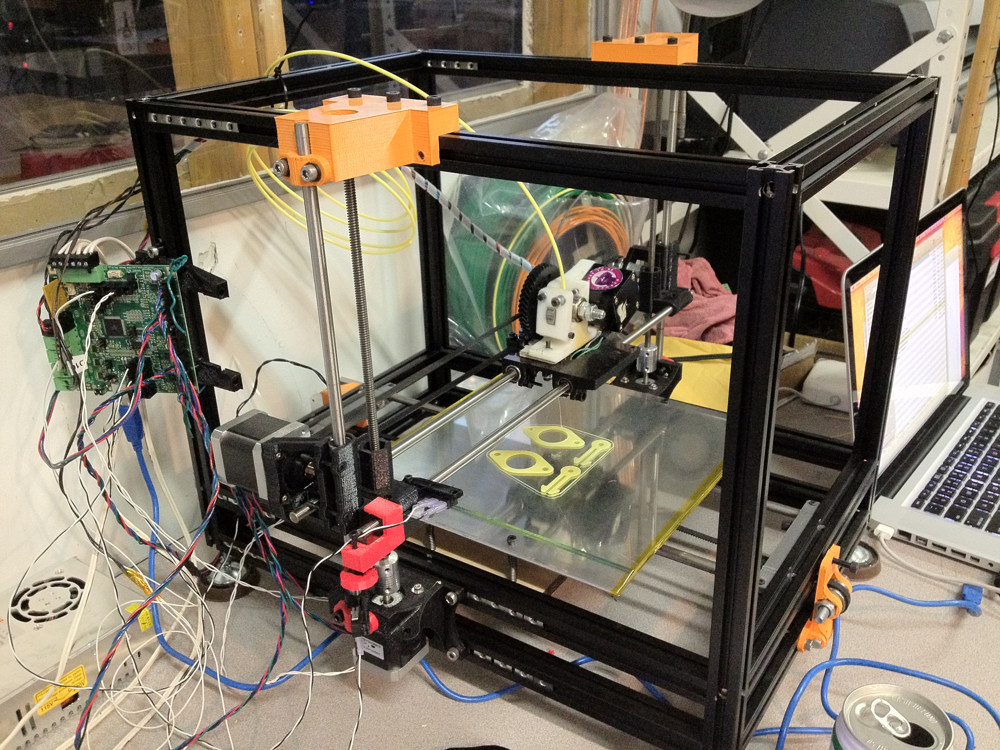
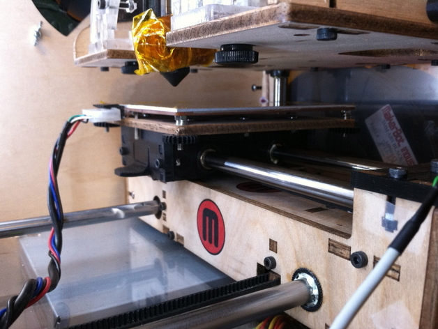
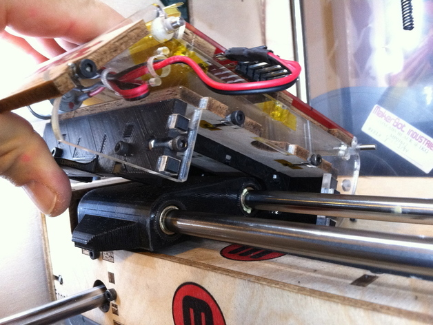
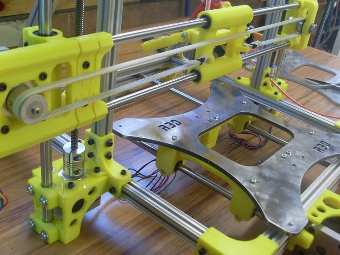
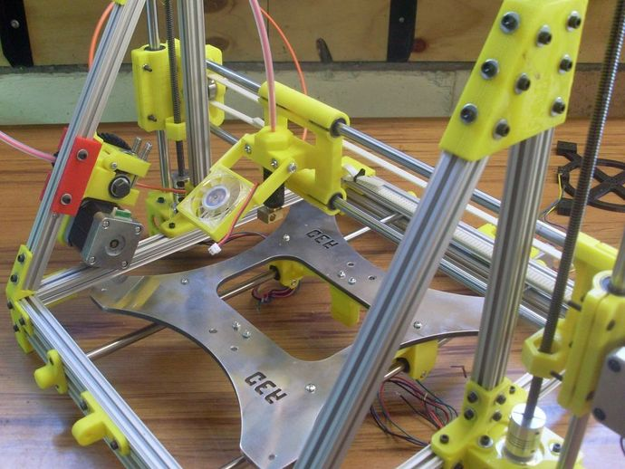
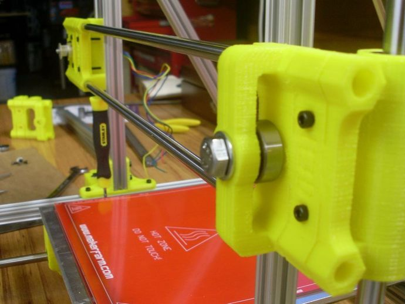
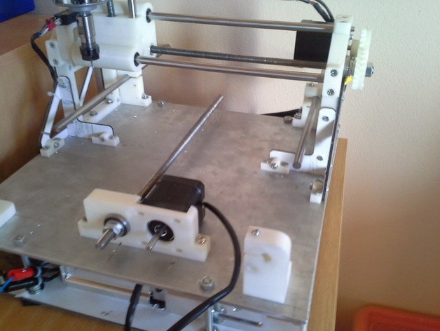

#Prepare upgrade for Mendel Max

**Моторы сверху**

- Я думаю, что если нам поставить моторы сверху, то возможно удастся избежать перекоса шпилек оси "Z"

**Жесткая конструкция**

- Жесткая конструкция позволит удобнее обслуживать принтер, широкий выбор места для датчиков, а так же удобнее снимать модели

**Новая конструкция стола**
- Новая конструкция стола поможет легко обслуживать печатный стол, а так же повысит жесткость осей, что позволить избежать перекосов оси "Y" и ремня

	

	

	

	

	

	

	

**Перевернутые оси "X"**

- Новое местоположение моторов и перевернутые рельсы оси "Х" возможно позволят упростить калибровку оси "Z"

	

	

**Замена ремня на резьбовую ось**

- Честно говоря не знаю, что это даст, но думаю, что это улучшит качество моделей, так как движение стола будет более медленным

 

